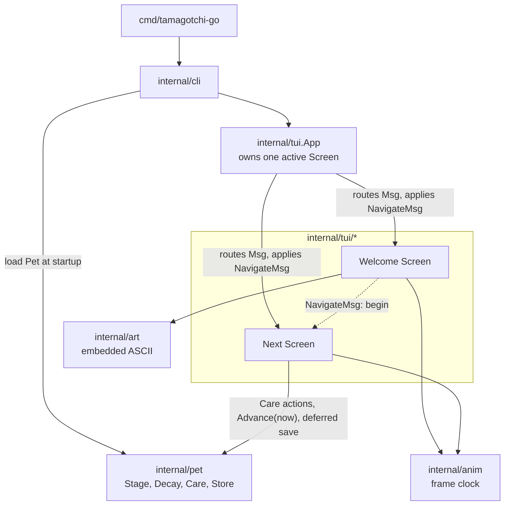

# Tamagotchi Go

[](https://github.com/leekli/tamagotchi-go/actions/workflows/ci.yml)


[](LICENSE)

A command-line pet game in the style of the original first-generation Tamagotchi
toy (1996–1997), built in Go with the [Bubble Tea](https://github.com/charmbracelet/bubbletea)
TUI framework.

```
 ____   ____  _    _  ____   ____   ____   ____   ____  _    _  ____
(_  _) ( __ ) |\  /| ( __ ) / ___) / __ \ (_  _) / ___) | |  | (_  _)
  ||   | || | | \/ | | || | | / _  | |  |   ||   | / __ | |__|   ||
  ||   |(__)| | /\ | |(__)| | (_ ) | |  |   ||   | \__  |  __|   ||
  ||   | || | |/  \| | || | \ __/  \ __ /   ||   \ ___) | |  |  _||_
  ()   |_||_| |_||_| |_||_|  \__)   \__/    ()    \__)  |_|  | (____)

                             ,--.
                            ( o o)
                             >`-'
```

> [!NOTE]
> This project is built using `Claude Code`. This is a project to aid my own learning of using Agentic AI tooling 🤖

## Features

- A living, persisted Pet on the Next Screen: it's born an Egg, hatches into a
  Baby, and its Hunger and Happiness decay over real elapsed time — whether or
  not the game is running. State survives a restart (`internal/pet`).
- A full Care loop once the Pet is a Baby: Feed it a Meal or a Snack, Play
  with it, or Clean up a Mess it's left uncleaned for too long — each
  reachable by keyboard or mouse, with immediate feedback in the stat meters.
- A screen-routed TUI that clears the terminal on entry and restores it on exit.
- A hand-authored ASCII wordmark with a one-pass shine sweep, a wandering
  animated Character, and a pulsing begin prompt — all on a deterministic,
  test-driven frame clock (`internal/anim`).
- Keyboard **and** mouse throughout; clicks are matched to precise on-screen
  regions with [bubblezone](https://github.com/lrstanley/bubblezone).
- Scrolls gracefully in small terminals; shows a resize hint below 80×24.
- Adaptive colour that reads on light and dark terminals, with `NO_COLOR` and
  `--no-color` support.

## Controls

| Key                                                                                              | Action                                                                                 |
| ------------------------------------------------------------------------------------------------ | -------------------------------------------------------------------------------------- |
| <kbd>Enter</kbd>, or a click on the begin prompt                                                 | Begin (advance from the Welcome Screen)                                                |
| <kbd>↑</kbd> <kbd>↓</kbd> <kbd>PgUp</kbd> <kbd>PgDn</kbd> <kbd>Home</kbd> <kbd>End</kbd> / wheel | Scroll (on scrollable Screens)                                                         |
| <kbd>←</kbd> <kbd>→</kbd> / <kbd>h</kbd> <kbd>l</kbd>, or a click on an icon                     | Select a Care action or Feed's Meal/Snack choice (Next Screen, once the Pet is a Baby) |
| <kbd>Enter</kbd>                                                                                 | Activate the selected icon or choice (Next Screen)                                     |
| <kbd>f</kbd> <kbd>p</kbd> <kbd>c</kbd>                                                           | Feed, Play, or Clean directly, from any selection (Next Screen)                        |
| <kbd>m</kbd> <kbd>s</kbd>                                                                        | Choose Meal or Snack directly, once Feed's chooser is open (Next Screen)               |
| <kbd>Esc</kbd>                                                                                   | Cancel Feed's Meal/Snack chooser (Next Screen); quit (Welcome Screen)                  |
| <kbd>Ctrl</kbd>+<kbd>C</kbd>                                                                     | Quit (any Screen)                                                                      |

## Requirements

- Go 1.26 or newer
- A terminal at least 80×24, with ANSI support

## Install and run

From source:

```sh
git clone https://github.com/leekli/tamagotchi-go.git
cd tamagotchi-go
go run ./cmd/tamagotchi-go
```

Or install the binary onto your `PATH`:

```sh
go install github.com/leekli/tamagotchi-go/cmd/tamagotchi-go@latest
tamagotchi-go
```

Flags: `--version`, `--no-color`, `--save-path` (override the save file
location, mainly for testing), `--help`.

## Testing

```sh
go test ./...                                   # unit + integration
go test -race -covermode=atomic ./...           # the full run, as CI does it
go test -short ./...                             # skip the binary smoke test
go test -covermode=atomic -coverprofile=cover.out ./... && go tool cover -func=cover.out
```

Layers: unit tests on pure functions and each Screen's `Update`/`View`;
integration tests driving the real Bubble Tea program with
[`teatest`](https://github.com/charmbracelet/x/tree/main/exp/teatest); a smoke
test that builds the binary and drives it through a pseudo-terminal; acceptance
tests written as given/when/then subtests. Animation is deterministic — tests
feed `anim.TickMsg`s rather than sleeping. The coverage gate
(`.testcoverage.yml`) requires ≥ 93% overall and ratchets upward.

Representative shine-sweep frames are locked with golden files under
`internal/tui/welcome/testdata/`. After an intentional change to the wordmark
or the sweep, regenerate them:

```sh
go test ./internal/tui/welcome -run TestWordmarkGoldenFrames -update
```

## Architecture

The entrypoint (`cmd/tamagotchi-go`) is a one-liner over `internal/cli`, which
parses flags and starts the program. `internal/tui` holds the `App` — an
Elm-style root model that owns exactly one active `Screen`, routes messages to
it, and applies navigation. Navigation **replaces** the active Screen; Screens
communicate only by emitting a `NavigateMsg` naming a `ScreenID`, so they never
depend on each other. The `App` wraps each Screen in shared chrome: a resize
notice when the terminal is too small, an optional scrolling viewport, and a
one-line help bar. It also scans each composed frame for
[bubblezone](https://github.com/lrstanley/bubblezone) markers so Screens can
name precise click targets.



Two small support packages back the Welcome Screen: `internal/anim` (a
fixed-rate frame clock and easing helpers, injectable so animation is
deterministic under test) and `internal/art` (a `//go:embed` loader for the
hand-authored ASCII art, plus a left-right mirror helper).

`internal/pet` is the game's first domain package: the `Pet` type, its
derived Stage and Age, a pure `Advance(now)` Decay function, and a `Store`
interface (file-backed in production) for persistence. It performs no direct
I/O itself — loading happens once at startup in `internal/cli`, and saving
from the running Next Screen happens via a deferred command, on its own slow
simulation clock and again on quit.

Decisions with lasting consequences are recorded in
[`docs/adr/`](docs/adr/). The domain vocabulary is defined in
[`CONTEXT.md`](CONTEXT.md).

## Project layout

```
cmd/tamagotchi-go/      entrypoint
internal/cli/           command-line argument wiring
internal/tui/           App router, Screen interface, shared styles and keys
internal/tui/welcome/   Welcome Screen (wordmark, shine sweep, Character, prompt)
internal/tui/next/      Next Screen (the Pet: art, meters, age, weight, Care actions)
internal/pet/           Pet domain model: Stage, Decay, Care actions, and persistence
internal/anim/          fixed-rate frame clock and easing helpers
internal/art/           embedded ASCII art loader and mirror helper
docs/adr/               architecture decision records
.github/workflows/      CI pipeline
```

## Licence

[MIT](LICENSE).

---

_Unofficial fan project. Not affiliated with, endorsed by, or sponsored by
Bandai. "Tamagotchi" is a registered trademark of Bandai._
