# Tamagotchi Go

[](https://github.com/leekli/tamagotchi-go/actions/workflows/ci.yml)


[](LICENSE)

A command-line pet game in the style of the original first-generation Tamagotchi
toy (1996–1997), built in Go with the [Bubble Tea](https://github.com/charmbracelet/bubbletea)
TUI framework.

<div style="display: flex;">
  
  
  
</div> 

```
 ____   ____  _    _  ____   ____   ____   ____   ____  _    _  ____
(_  _) ( __ ) |\  /| ( __ ) / ___) / __ \ (_  _) / ___) | |  | (_  _)
  ||   | || | | \/ | | || | | / _  | |  |   ||   | / __ | |__|   ||
  ||   |(__)| | /\ | |(__)| | (_ ) | |  |   ||   | \__  |  __|   ||
  ||   | || | |/  \| | || | \ __/  \ __ /   ||   \ ___) | |  |  _||_
  ()   |_||_| |_||_| |_||_|  \__)   \__/    ()    \__)  |_|  | (____)

                             ,--.
                            ( o o)
                             >`-'
```

> [!NOTE]
> This project is built using `Claude Code`. This is a project to aid my own learning of using Agentic AI tooling 🤖

## Features

- A living, persisted Pet on the Next Screen: it's born an Egg, hatches into a
  Baby, grows into a Child, a Teen, and an Adult, and eventually dies of old
  age, or sooner of neglect, starvation or untreated sickness — its
  current Stage always shown as a label beneath its art — while its
  Hunger and Happiness decay over real elapsed time, whether or not the game
  is running. State persists between runs (`internal/pet`). Once it has
  died, a panel says why and hatching a brand new Egg is one keypress or click
  away, whatever the cause and even if it died while the game was closed.
- A full Care loop once the Pet has hatched: Feed it a Meal or a Snack, Play
  with it, Clean up a Mess it's left uncleaned for too long, or Cure it — each
  reachable by keyboard or mouse, with immediate feedback in the stat meters,
  and unaffected by growing from Baby all the way to Adult (once the Pet has
  died, there's nothing left to Feed, Play with, or Clean). Play also works
  off Weight gained from Snacking; let it climb too high and the Pet becomes
  Overfed, which speeds up Happiness decay the same way an uncleaned Mess
  does.
- Neglect has consequences. A Mess left uncleaned makes the Pet Sick (a
  `[+] Sick` indicator appears; only a Cure ends it, not cleaning up), and a Stat
  left at 0 for too long costs a hidden Care mistake, which shortens the Pet's
  life. The Pet can die of Old age, Neglect, Starvation or Sickness, and the
  Death panel says which, and how many Care mistakes it had.
- The Pet calls for attention when a Stat empties: `(!) Hungry` (Feed it) or
  `(!) Sad` (Play with it) appears in its STATS panel, turning to `(!!) HUNGRY` /
  `(!!) SAD` once the grace window has lapsed and the mistake is counted. The
  wording, not just the colour, tells the phases apart, so it reads on a
  monochrome terminal too, and it never beeps.
- A screen-routed TUI that clears the terminal on entry and restores it on exit.
- A hand-authored ASCII wordmark with a one-pass shine sweep, a wandering
  animated Character, and a pulsing begin prompt — all on a deterministic,
  test-driven frame clock (`internal/anim`).
- Keyboard **and** mouse throughout; clicks are matched to precise on-screen
  regions with [bubblezone](https://github.com/lrstanley/bubblezone).
- Shows a resize hint below 80×24, and the App can scroll a longer Screen in a
  viewport (the Welcome and Next Screens are authored to fit and never need it).
- Adaptive colour that reads on light and dark terminals, with `NO_COLOR` and
  `--no-color` support.

## Game rules

A Pet lives for about an hour of real time. The clock never stops: while the
game is closed the Pet carries on, and the next launch catches up on everything
that happened, including a death. All the timings below are deliberately
compressed from the original toy, so a whole life fits in one sitting.

### A life, from Egg to Death

| Stage | Begins at | Lasts     |
| ----- | --------- | --------- |
| Egg   | 0:00      | 30 seconds |
| Baby  | 0:30      | 10 minutes |
| Child | 10:30     | 15 minutes |
| Teen  | 25:30     | 15 minutes |
| Adult | 40:30     | 20 minutes |
| Death | 60:30     | —          |

A Pet that is looked after well dies of old age at 60:30. Each Care mistake
(see below) shortens the Adult Stage by 2 minutes, never below 5, so even the
worst-kept Pet reaches Adulthood, and the shortest possible life is 45:30. The
Icon bar and the Care actions appear when the Pet hatches, and disappear again
when it dies.

### Stats and Decay

Hunger and Happiness each run from 0 to 4, shown as a four-segment meter, and
both start full. Each falls by one point every 3 minutes (**Decay**), so a full
Stat is Empty after 12 minutes. Happiness falls twice as fast, one point every
90 seconds, while the Pet has a Mess or is Overfed (the two don't stack).
Weight starts at 2 g and never decays: only Snack raises it and Play lowers it,
between 2 g and 12 g. At 5 g or more the Pet is Overfed.

### Care actions

| Action | Key            | Effect                                              |
| ------ | -------------- | --------------------------------------------------- |
| Meal   | <kbd>f</kbd> <kbd>m</kbd> | Hunger +1                                |
| Snack  | <kbd>f</kbd> <kbd>s</kbd> | Happiness +1, Weight +1 g                |
| Play   | <kbd>p</kbd>   | Happiness +1, Weight −1 g                           |
| Clean  | <kbd>c</kbd>   | Removes the Mess                                    |
| Cure   | <kbd>u</kbd>   | Ends Sickness (does nothing for a healthy Pet)      |

Hunger and Happiness never go above 4. One action gives one point, so an Empty
Stat needs several actions to fill.

### Mess and Sickness

A Mess appears 5 minutes after the Pet was last cleaned (or born). If it is
still there 5 minutes later, the Pet falls **Sick**. Cleaning up removes the
Mess but does not cure the Pet: only a Cure does. A Pet Cured while its Mess is
still there falls Sick again 5 minutes after the Cure. A Sick Pet can still be
fed and played with, but one left Sick for 8 minutes without a Cure dies of
Sickness.

### Neglect and Care mistakes

A Stat is **Empty** when it reaches 0. From that moment the Pet calls for
attention, and you have a **grace window** of 4 minutes to lift the Stat above 0.
If you don't, the Pet racks up a **Care mistake**: one per Stat per Empty spell,
however long the spell lasts. A Pet at 0 Happiness is never killed by it, but
every Care mistake, from any Stage, shortens its Adult Stage as above. The tally
stays hidden until the Pet dies.

The Attention call is `(!) Hungry` or `(!) Sad` while the grace window runs, and
`(!!) HUNGRY` or `(!!) SAD` once it has lapsed, until you refill the Stat. While
the Pet is Sick it doesn't call, no grace window runs and no mistakes are
counted; a Cure resumes each window where it left off.

### Death

| Cause      | When                                                                 |
| ---------- | -------------------------------------------------------------------- |
| Old age    | The Adult Stage runs out with no Care mistakes on the tally          |
| Neglect    | The Adult Stage, shortened by Care mistakes, runs out                |
| Starvation | Hunger stays Empty for 10 minutes (even while the Pet is Sick)       |
| Sickness   | The Pet stays Sick for 8 minutes without a Cure                      |

Whichever comes first is the cause; if two fall at the very same instant the
order is Starvation, Sickness, then Neglect or Old age. Death is recorded at the
exact moment it happened, even if the game was closed at the time. The Death
panel then shows the Pet's age, weight, cause of death and Care mistakes, its
Stats stop changing, and <kbd>Enter</kbd> (or a click on the prompt) hatches a
new Egg.

### Worked examples

| If you…                                   | What happens                                                                                                                       |
| ----------------------------------------- | ---------------------------------------------------------------------------------------------------------------------------------- |
| Never touch the Pet                       | 5:00 Mess · 8:30 Happiness Empty · 10:00 Sick · 12:00 Hunger Empty · **18:00 dies of Sickness** (Starvation would only come at 22:00) |
| Keep it clean but never feed or play      | 12:00 Hunger and Happiness Empty · 16:00 two Care mistakes · **22:00 dies of Starvation**                                          |
| Look after it perfectly                   | No Care mistakes · **60:30 dies of Old age**                                                                                       |
| Rack up 8 or more Care mistakes           | The Adult Stage shrinks to its 5-minute minimum · **45:30 at the earliest, dies of Neglect**                                       |

## Controls

Everything you can do with a key you can do with the mouse.

| Input                                                                | Action                                                                     |
| -------------------------------------------------------------------- | -------------------------------------------------------------------------- |
| <kbd>Enter</kbd>, or a click on the begin prompt                     | Begin (Welcome Screen)                                                     |
| <kbd>←</kbd> <kbd>→</kbd> / <kbd>h</kbd> <kbd>l</kbd>, or a click on a tab | Select a Care action on the Icon bar, or Meal or Snack once Feed's chooser is open (Next Screen, once the Pet has hatched) |
| <kbd>Enter</kbd>                                                     | Activate the selected Care action or choice                                |
| <kbd>f</kbd> <kbd>p</kbd> <kbd>c</kbd> <kbd>u</kbd>                  | Feed (opens the chooser), Play, Clean or Cure directly, from any selection |
| <kbd>m</kbd> <kbd>s</kbd>                                            | Choose Meal or Snack directly, once Feed's chooser is open                 |
| <kbd>Esc</kbd>                                                       | Close Feed's chooser (Next Screen); quit (Welcome Screen)                  |
| <kbd>Enter</kbd>, or a click on the prompt                           | Hatch a new Egg, once the Pet has died (Next Screen)                       |
| <kbd>Ctrl</kbd>+<kbd>C</kbd>                                         | Quit (any Screen); the Pet is saved first                                  |

While Feed's chooser is open, the direct <kbd>f</kbd> <kbd>p</kbd> <kbd>c</kbd> <kbd>u</kbd>
keys do nothing until you choose or cancel.

## Requirements

- Go 1.26 or newer (to build from source)
- A terminal at least 80×24, with ANSI support; a mouse is optional

## Install and run

From source:

```sh
git clone https://github.com/leekli/tamagotchi-go.git
cd tamagotchi-go
go run ./cmd/tamagotchi-go
```

Or install the binary onto your `PATH`:

```sh
go install github.com/leekli/tamagotchi-go/cmd/tamagotchi-go@latest
tamagotchi-go
```

### Build

To build a binary in the current directory, and run it:

```sh
go build -o tamagotchi-go ./cmd/tamagotchi-go
./tamagotchi-go
```

To stamp it with version information (shown by `--version`), and cross-compile
for another platform:

```sh
go build -trimpath -o tamagotchi-go \
  -ldflags "-s -w \
    -X github.com/leekli/tamagotchi-go/internal/cli.version=1.0.0 \
    -X github.com/leekli/tamagotchi-go/internal/cli.commit=$(git rev-parse --short HEAD) \
    -X github.com/leekli/tamagotchi-go/internal/cli.date=$(date -u +%Y-%m-%dT%H:%M:%SZ)" \
  ./cmd/tamagotchi-go

GOOS=windows GOARCH=amd64 go build -o tamagotchi-go.exe ./cmd/tamagotchi-go
```

`go build ./...` compiles every package without producing a binary, which is a
quick way to check that everything still builds.

### Flags and the save file

Flags: `--version`, `--no-color`, `--save-path` (override the save file
location, mainly for testing), `--help`. The `NO_COLOR` environment variable is
honoured too.

The Pet is saved as `save.json` in a `tamagotchi-go` folder inside your user
config directory (`~/.config` on Linux, `~/Library/Application Support` on
macOS, `%AppData%` on Windows), every 20 seconds and again on quit. Delete the
file to start over with a fresh Egg.

## Testing

```sh
go test ./...                                   # unit + integration
go test -race -covermode=atomic ./...           # the full run, as CI does it
go test -short ./...                             # skip the binary smoke test
go test -covermode=atomic -coverprofile=cover.out ./... && go tool cover -func=cover.out
```

Layers: unit tests on pure functions and each Screen's `Update`/`View`;
integration tests driving the real Bubble Tea program with
[`teatest`](https://github.com/charmbracelet/x/tree/main/exp/teatest); a smoke
test that builds the binary and drives it through a pseudo-terminal; acceptance
tests written as given/when/then subtests. Animation is deterministic — tests
feed `anim.TickMsg`s rather than sleeping. The coverage gate
(`.testcoverage.yml`) requires ≥ 93% overall and ratchets upward.

Representative shine-sweep frames are locked with golden files under
`internal/tui/welcome/testdata/`. After an intentional change to the wordmark
or the sweep, regenerate them:

```sh
go test ./internal/tui/welcome -run TestWordmarkGoldenFrames -update
```

Lint and vulnerability checks, which CI also runs:

```sh
golangci-lint run ./...                          # lint (auto-format with `golangci-lint fmt ./...`)
go run golang.org/x/vuln/cmd/govulncheck@latest ./...
```

`lefthook install` sets up git hooks that run the same gate before each commit
and push.

## Architecture

The entrypoint (`cmd/tamagotchi-go`) is a one-liner over `internal/cli`, which
parses flags, loads the save (catching the Pet up on the time the game was
closed) and starts the program. `internal/tui` holds the `App`: an Elm-style
root model that owns exactly one active `Screen` and routes messages to it.
Navigation **replaces** the active Screen. Screens never depend on each other;
they emit a `NavigateMsg` naming a `ScreenID`. The `App` frames every Screen in
shared chrome (a resize notice below 80×24, an optional scrolling viewport and a
one-line help bar) and scans each frame for
[bubblezone](https://github.com/lrstanley/bubblezone) markers, so Screens can
name precise click targets.

```mermaid
flowchart TD

subgraph group_entry["Entry Layer"]
  node_main["CLI Binary<br/>[main.go]"]
  node_cli["CLI Runner<br/>[cli.go]"]
end

subgraph group_ui["TUI Layer"]
  node_app["App Router<br/>[app.go]"]
  node_welcome["Welcome Screen<br/>[welcome.go]"]
  node_next["Next Screen<br/>[next.go]"]
  node_panel["Panel Renderer<br/>[panel.go]"]
  node_zones["Click Zones<br/>[zone.go]"]
end

subgraph group_domain["Pet Domain"]
  node_pet["Pet State<br/>[pet.go]"]
  node_care["Care Actions<br/>[actions.go]"]
  node_decay["Decay Neglect<br/>[decay.go]"]
  node_death["Death Rules<br/>[death.go]"]
  node_beat["Simulation Beat<br/>[beat.go]"]
end

subgraph group_support["Timing Assets"]
  node_anim["Animation Clock<br/>[anim.go]"]
  node_art["ASCII Art<br/>[art.go]"]
end

subgraph group_storage["Persistence"]
  node_store[("Pet Save Store<br/>[store.go]")]
end

node_player(("Player"))
node_terminal(("Terminal"))
node_clock(("System Clock"))

node_terminal -->|"launches"| node_main
node_player -->|"begins"| node_welcome
node_player -->|"cares"| node_next
node_main -->|"runs"| node_cli
node_clock -->|"timestamps"| node_cli
node_cli -->|"loads"| node_store
node_store -->|"returns state"| node_cli
node_cli -->|"creates or advances"| node_pet
node_cli -->|"wires and starts"| node_app
node_app -->|"dispatches"| node_welcome
node_welcome -->|"requests navigation"| node_app
node_app -->|"replaces screen"| node_next
node_next -->|"advances state"| node_pet
node_next -->|"invokes care"| node_care
node_next -->|"schedules beats"| node_beat
node_beat -->|"delivers beats"| node_next
node_pet -->|"applies decay"| node_decay
node_pet -->|"evaluates death"| node_death
node_next -->|"saves on quit"| node_store
node_welcome -->|"schedules frames"| node_anim
node_next -->|"schedules frames"| node_anim
node_welcome -->|"loads artwork"| node_art
node_next -->|"loads artwork"| node_art
node_welcome -->|"marks clicks"| node_zones
node_next -->|"marks clicks"| node_zones
node_app -->|"scans coordinates"| node_zones
node_next -->|"renders panels"| node_panel

click node_main "https://github.com/leekli/tamagotchi-go/blob/main/cmd/tamagotchi-go/main.go"
click node_cli "https://github.com/leekli/tamagotchi-go/blob/main/internal/cli/cli.go"
click node_app "https://github.com/leekli/tamagotchi-go/blob/main/internal/tui/app.go"
click node_welcome "https://github.com/leekli/tamagotchi-go/blob/main/internal/tui/welcome/welcome.go"
click node_next "https://github.com/leekli/tamagotchi-go/blob/main/internal/tui/next/next.go"
click node_panel "https://github.com/leekli/tamagotchi-go/blob/main/internal/tui/panel.go"
click node_zones "https://github.com/leekli/tamagotchi-go/blob/main/internal/tui/zone.go"
click node_pet "https://github.com/leekli/tamagotchi-go/blob/main/internal/pet/pet.go"
click node_care "https://github.com/leekli/tamagotchi-go/blob/main/internal/pet/actions.go"
click node_decay "https://github.com/leekli/tamagotchi-go/blob/main/internal/pet/decay.go"
click node_death "https://github.com/leekli/tamagotchi-go/blob/main/internal/pet/death.go"
click node_beat "https://github.com/leekli/tamagotchi-go/blob/main/internal/pet/beat.go"
click node_anim "https://github.com/leekli/tamagotchi-go/blob/main/internal/anim/anim.go"
click node_art "https://github.com/leekli/tamagotchi-go/blob/main/internal/art/art.go"
click node_store "https://github.com/leekli/tamagotchi-go/blob/main/internal/pet/store.go"

classDef toneNeutral fill:#f8fafc,stroke:#334155,stroke-width:1.5px,color:#0f172a
classDef toneBlue fill:#dbeafe,stroke:#2563eb,stroke-width:1.5px,color:#172554
classDef toneAmber fill:#fef3c7,stroke:#d97706,stroke-width:1.5px,color:#78350f
classDef toneMint fill:#dcfce7,stroke:#16a34a,stroke-width:1.5px,color:#14532d
classDef toneRose fill:#ffe4e6,stroke:#e11d48,stroke-width:1.5px,color:#881337
classDef toneIndigo fill:#e0e7ff,stroke:#4f46e5,stroke-width:1.5px,color:#312e81
classDef toneTeal fill:#ccfbf1,stroke:#0f766e,stroke-width:1.5px,color:#134e4a
class node_main,node_cli toneBlue
class node_app,node_welcome,node_next,node_panel,node_zones toneAmber
class node_pet,node_care,node_decay,node_death,node_beat toneMint
class node_anim,node_art toneRose
class node_store,node_player,node_terminal,node_clock toneIndigo
```



`internal/pet` is the domain package, and does no I/O. Its `Advance(now)` is the
only thing that moves time: Decay, Empty spells and Care mistakes, Sickness and
the exact moment of Death all follow from it, and one long catch-up gives the same
Pet as many short steps. Care actions and the derived Attention call live beside
it. What neglect needs remembered is stored on the Pet rather than derived
([ADR-0008](docs/adr/0008-care-history-is-stored-not-derived.md)). A `Store`
interface (file-backed in production) handles persistence: loading happens once
at startup, and saving is a deferred command on every 20-second `Beat` and again
on quit.

Two small packages back both Screens: `internal/anim` (a fixed-rate frame clock,
so animation is a pure function of a frame count and tests never sleep) and
`internal/art` (the `//go:embed` loader for the hand-authored ASCII art).

Decisions with lasting consequences are recorded in
[`docs/adr/`](docs/adr/). The domain vocabulary is defined in
[`CONTEXT.md`](CONTEXT.md).

## Project layout

```
cmd/tamagotchi-go/      entrypoint
internal/cli/           flag parsing, save loading and catch-up, wiring the Screens
internal/tui/           App router, Screen interface, Panel and chip primitives, click zones, palette
internal/tui/welcome/   Welcome Screen (wordmark, shine sweep, Character, prompt)
internal/tui/next/      Next Screen (the Pet: art, meters, Sick and Attention call, Icon bar, Death panel)
internal/pet/           Pet domain model: Stage, Decay, Care actions, neglect, Sickness, Death, Beat, persistence
internal/anim/          fixed-rate frame clock and easing helpers
internal/art/           embedded ASCII art loader and mirror helper
docs/adr/               architecture decision records
docs/agents/            issue tracker and triage settings for AI agent tooling
CONTEXT.md              the domain glossary
.github/workflows/      CI pipeline
```

## Licence

[MIT](LICENSE).

---

_Unofficial fan project. Not affiliated with, endorsed by, or sponsored by
Bandai. "Tamagotchi" is a registered trademark of Bandai._
